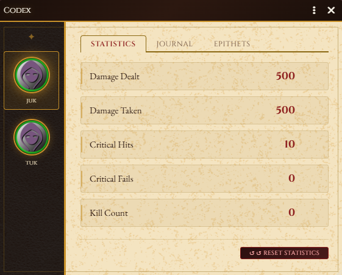
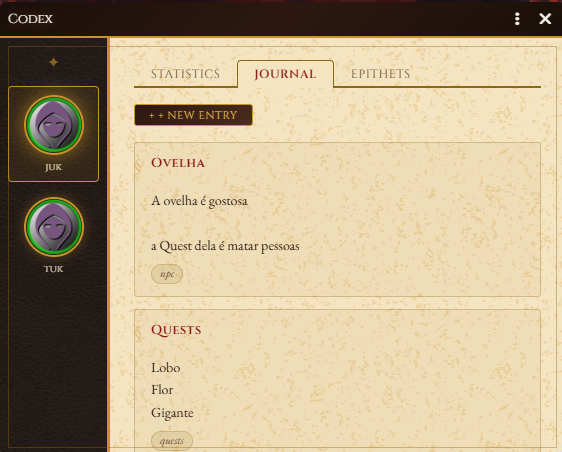
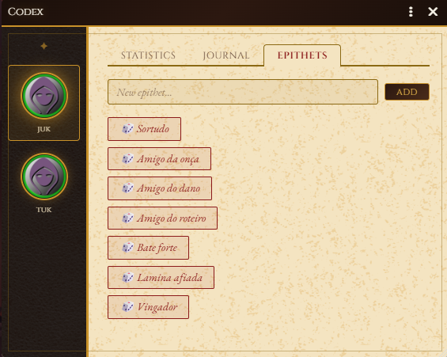

# Codex — Campaign Grimoire for Foundry VTT

> *"Every hero deserves to have their story told."*

Codex is a Foundry VTT module that works as a campaign grimoire — automatically tracking each adventurer's combat statistics, earned epithets, and a free-form expedition journal.



---

## Features

### 📊 Combat Statistics
Automatically captured from chat rolls — no setup required:
- **Damage Dealt** — total damage caused by the character
- **Damage Taken** — total damage received
- **Critical Hits** — number of critical successes rolled
- **Critical Fails** — number of critical failures rolled
- **Kill Count** — manually tracked, because not every kill happens inside Foundry

All statistics can be manually edited by the GM at any time.



### 📖 Expedition Journal
A free-form journal for each character. Players and GMs can create entries with:
- **Title** — session number, in-game date, or whatever fits the narrative
- **Content** — free text, no formatting restrictions
- **Tags** — built-in tags (`combat`, `npc`, `secret`, `reminder`) plus any custom tag

### ⚔️ Epithets


Characters earn epithets in two ways:

**Automatic** — unlocked when stat thresholds are reached:

| Stat | Threshold | Epithet |
|---|---|---|
| Kill Count | 25 | Hothead |
| Kill Count | 50 | Assassin |
| Kill Count | 75 | Butcher |
| Kill Count | 100 | Bloodthirsty |
| Critical Hits | 10 | Lucky |
| Critical Hits | 25 | Blessed |
| Critical Hits | 50 | Wheel of Fortune |
| Critical Fails | 10 | Jammed |
| Critical Fails | 25 | Fumbler |
| Critical Fails | 50 | Atomized by the Dice |
| Damage Taken | 75 | Friend of Pain |
| Damage Taken | 250 | Damage Magnet |
| Damage Taken | 500 | Plot Armor |
| Damage Dealt | 100 | Hard Hitter |
| Damage Dealt | 250 | Sharp Blade |
| Damage Dealt | 500 | Avenger |
| Damage Dealt | 1000 | The Unstoppable |

**Manual** — the GM or players can add any epithet they want. These are never removed automatically.

---

## Multi-System Support

Codex works with any RPG system. Go to **Game Settings → Codex** and configure:

| Setting | Default | Description |
|---|---|---|
| HP Path | `system.attributes.hp.value` | Path to the HP attribute in your system |
| Attack Chat Flavor | `attacking` | Word that identifies attack messages in chat |

To find the HP path for your system, open the browser console (F12) and run:
```js
game.actors.contents[0].system
```

**Tested systems:**
- Shadowdark RPG
- D&D 5e (set Attack Chat Flavor to `attack`)

---

## Installation

### From the Foundry Module Browser
Search for **Codex** in the Add-on Modules browser.

### Manual Install
1. In Foundry VTT, go to **Add-on Modules**
2. Click **Install Module**
3. Paste the manifest URL:
   ```
   https://github.com/YOUR_USERNAME/codex/releases/latest/download/module.json
   ```

---

## Compatibility

| Foundry Version | Status |
|---|---|
| v13 | ✅ Verified |
| v12 | ⚠️ Untested |
| v11 | ⚠️ Untested |

---

## Languages

- 🇺🇸 English
- 🇧🇷 Português (Brasil)

---

## License

[MIT License](LICENSE.md) — free to use, modify, and distribute.

---

## Credits

Developed by **Riuchek** for Shadowdark RPG campaigns.

Typography: [Cinzel](https://fonts.google.com/specimen/Cinzel) and [EB Garamond](https://fonts.google.com/specimen/EB+Garamond) via Google Fonts.

Texture: [Transparent Textures](https://www.transparenttextures.com/).